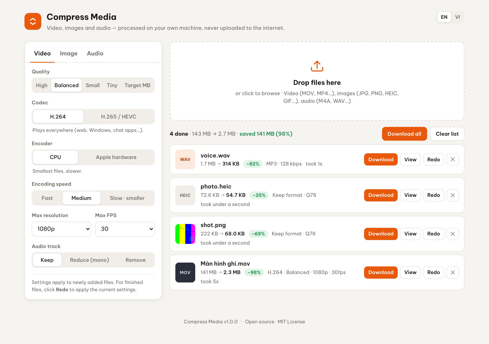

# Compress Media

[English](README.md) · **Tiếng Việt**

[](https://github.com/material-atomic/compress-media/actions/workflows/ci.yml)
[](https://hub.docker.com/r/runsnip/compress-media)
[](https://hub.docker.com/r/runsnip/compress-media)
[](LICENSE)

Công cụ tự host để nén **video, ảnh và âm thanh**. Có giao diện web kéo thả, CLI và HTTP API, dùng ffmpeg và sharp.

- Ra đời để xử lý các video quay màn hình QuickTime nặng hàng GB: một bản ghi 2880×1800, 60fps thường **nhỏ đi 90–98%**.
- File được xử lý ngay trên máy hoặc server của bạn.
- File lớn được upload theo từng phần, tải tiếp được khi bị gián đoạn, và có thể upload thẳng lên kho lưu trữ chuẩn S3.



## Mục lục

[Tính năng](#tính-năng) · [Các cách dùng](#các-cách-dùng) · [Bắt đầu nhanh](#bắt-đầu-nhanh) · [Giao diện web](#giao-diện-web) · [CLI](#cli) · [HTTP API](#http-api) · [Cấu hình](#cấu-hình) · [Lưu trữ đối tượng](#lưu-trữ-đối-tượng-s3) · [Nền tảng](#nền-tảng-hỗ-trợ) · [AI agent](#dùng-với-ai-agent) · [Bảo mật](#bảo-mật) · [Phát triển](#phát-triển) · [Giấy phép](#giấy-phép)

## Tính năng

- **Video** (MOV, MP4, MKV, WebM, AVI…) → MP4.
  - H.264 (phát được ở mọi nơi) hoặc H.265 (nhỏ hơn 30–50%).
  - Chọn mức chất lượng có sẵn, hoặc đặt **dung lượng mục tiêu theo MB** khi cần vừa giới hạn upload.
  - Giảm độ phân giải, giới hạn FPS, giữ / giảm / bỏ âm thanh.
  - Nén bằng phần cứng **Apple VideoToolbox** trên macOS.
- **Ảnh** (JPG, PNG, WebP, AVIF, **HEIC**, GIF, TIFF).
  - Giữ định dạng cũ, hoặc chuyển sang JPEG, WebP, AVIF, PNG.
  - Chỉnh chất lượng và cạnh dài tối đa.
  - PNG được giảm số màu (giống pngquant).
  - GIF và WebP động vẫn giữ chuyển động.
  - Mặc định xóa metadata EXIF và vị trí GPS.
- **Âm thanh** (WAV, M4A, FLAC, AIFF, MP3…) → MP3, M4A hoặc Opus. Chọn được bitrate và mono.
- **Upload**
  - File được chia thành các phần 8 MB, gửi song song 4 phần một lúc.
  - Phần nào lỗi thì tự gửi lại. Bị gián đoạn thì tải tiếp được, kể cả sau khi tải lại trang.
  - Có thể gửi thẳng lên AWS S3, Cloudflare R2, GCS, MinIO, B2…
- **Tiện ích**
  - Nén nhiều file một lúc bằng cách kéo thả hoặc dán.
  - Hiện tiến độ và thời gian còn lại.
  - Xem trước bản gốc và bản nén cạnh nhau.
  - Nén lại với cài đặt khác mà không cần upload lại.
  - Hủy giữa chừng, tải tất cả một lần.
- **Giao diện** tiếng Anh và tiếng Việt, có chế độ sáng và tối, dùng được trên điện thoại.

## Các cách dùng

| | Phù hợp với | Bắt đầu bằng |
|---|---|---|
| **Giao diện web** | Người dùng thường: kéo file vào, tải kết quả về | `docker run … runsnip/compress-media` hoặc `npm start` |
| **CLI** | Script, nén cả thư mục, AI agent. Không cần server. | `compress-media clip.mov` |
| **HTTP API** | Ứng dụng hoặc dịch vụ khác gọi tới một server dùng chung | [docs/api.md](docs/api.md), [examples/](examples) |
| **AI agent** | Nhờ Claude hay agent khác nén file giúp, hoặc triển khai dịch vụ | [skills/](skills) |

## Bắt đầu nhanh

**Docker** (mọi hệ điều hành):

```bash
docker run -d --name compress-media -p 127.0.0.1:4747:4747 -v compress-media-data:/data runsnip/compress-media
```

Sau đó mở http://localhost:4747.

**Docker Compose** (đọc cài đặt từ file `.env`):

```bash
cp .env.example .env    # không bắt buộc
docker compose up -d
```

**Node.js 20+** (nên dùng trên Mac vì có nén bằng phần cứng và đọc được HEIC):

```bash
npm install
npm start               # http://localhost:4747
```

Không cần cài ffmpeg, `npm install` tự tải về. Nếu cổng 4747 đã có app khác dùng, server sẽ báo lỗi chứ không chen vào. Khi đó chạy `PORT=4848 npm start`.

## Giao diện web

1. Chọn cài đặt ở các tab **Video**, **Ảnh**, **Âm thanh**. Trình duyệt sẽ nhớ các cài đặt này.
2. Kéo thả, chọn hoặc dán file vào trang. Nhiều file được xử lý cùng lúc.
3. Mỗi dòng hiện tiến độ upload và tiến độ nén. Khi xong:
   - **Tải về** để lưu kết quả;
   - **Xem** để so sánh bản gốc với bản nén;
   - **Nén lại** để nén bằng cài đặt hiện tại mà không cần upload lại.
4. Nếu mạng rớt, dòng đó hiện nút **Tải tiếp**, bấm vào chỉ gửi những phần còn thiếu. Tải lại trang rồi thêm lại đúng file đó cũng sẽ tải tiếp.
5. **Tải tất cả** lưu mọi kết quả. **Xóa danh sách** xóa các dòng đã xong, cùng file của chúng trên server.

Nếu bản nén không nhỏ hơn bản gốc, dòng đó sẽ có cảnh báo, và bạn nên giữ bản gốc. Ngôn ngữ giao diện tự theo trình duyệt, đổi được bằng nút EN/VI ở góc trên.

## CLI

Cùng bộ xử lý nén như bản web, chạy thẳng từ terminal, không cần server.

```bash
npm install && npm link                                   # hoặc: node bin/cli.js …

compress-media "Screen Recording.mov" --max-res 1080 --fps 30
compress-media clip.mov --target-mb 24                   # vừa file đính kèm email
compress-media clip.mov --codec h265 --speed slow        # nhỏ nhất, cho thiết bị Apple / trình duyệt mới
compress-media ~/Pictures/trip -r --image-format webp --max-dim 2048 -o web
compress-media memo.m4a --audio-format opus --bitrate 48 --mono
compress-media probe clip.mov                             # xem độ phân giải, fps, thời lượng, codec
compress-media *.mov --json -q > report.json              # báo cáo JSON cho script
compress-media serve                                      # mở giao diện web
```

- Kết quả được ghi cạnh file gốc với tên `<tên>-compressed.<đuôi>`. File gốc không bao giờ bị sửa.
- Mã thoát: `0` là thành công hết, `1` là có file lỗi, `2` là gõ sai lệnh.
- Chạy qua Docker: `docker run --rm -v "$PWD:/work" -w /work runsnip/compress-media compress-media clip.mov`.

Đầy đủ các flag, định dạng báo cáo JSON và ghi chú về tốc độ: **[docs/cli.md](docs/cli.md)** (tiếng Anh).

## HTTP API

Giao diện web chạy trên một API JSON nhỏ, bạn có thể gọi trực tiếp:

1. Bắt đầu một lượt upload chia phần.
2. PUT từng phần, lên server hoặc thẳng lên bucket.
3. Hoàn tất upload, lúc này job nén được tạo.
4. Theo dõi trạng thái job.
5. Tải kết quả về.

Có sẵn hai client mẫu, đã xử lý việc thử lại và cả hai chế độ lưu trữ:

```bash
examples/compress.sh "Screen Recording.mov" '{"video":{"resolution":1080,"fps":30}}' http://localhost:4747   # bash + curl + jq
node examples/compress.mjs photo.heic '{"image":{"format":"webp"}}'                                        # Node.js 20+
```

Đầy đủ các endpoint, tùy chọn, mã lỗi và giao thức upload: **[docs/api.md](docs/api.md)**.

## Cấu hình

Mọi thứ cấu hình qua biến môi trường: đặt trực tiếp trên dòng lệnh, qua `docker run -e`, hoặc trong file `.env`. Cả `npm start` lẫn Docker Compose đều đọc file này, và biến môi trường đặt thật được ưu tiên hơn. Các biến hay dùng:

| Biến | Mặc định | Ý nghĩa |
|---|---|---|
| `PORT` / `HOST` | `4747` / `127.0.0.1` | Cổng và địa chỉ server lắng nghe |
| `PUBLIC_URL` | — | Địa chỉ công khai, ví dụ `https://media.example.com` (dùng để kiểm tra CORS của bucket) |
| `JOB_TTL_HOURS` | `3` | Sau bấy nhiêu giờ thì file bị xóa |
| `MAX_UPLOAD_MB` | `0` | Giới hạn dung lượng mỗi file (0 = không giới hạn) |
| `MEDIA_CONCURRENCY` | `1` | Số job video/âm thanh chạy song song |
| `UPLOAD_PART_MB` / `UPLOAD_CONCURRENCY` | `8` / `4` | Kích thước mỗi phần upload (nên để 5–100) và số phần gửi song song |
| `STORAGE` | `local` | `local` (ổ đĩa) hoặc `s3` (lưu trữ đối tượng) |
| `S3_BUCKET`, `S3_ENDPOINT`, `S3_REGION`, `S3_ACCESS_KEY_ID`, `S3_SECRET_ACCESS_KEY` | — | Thông tin kho lưu trữ S3 |

Danh sách đầy đủ: **[docs/configuration.md](docs/configuration.md)**. File mẫu có chú thích: [`.env.example`](.env.example).

## Lưu trữ đối tượng (S3)

Đặt `STORAGE=s3` thì trình duyệt sẽ **upload thẳng lên bucket** qua URL ký sẵn, dữ liệu upload không đi qua server app. Kết quả cũng được lưu trong bucket và tải về trực tiếp từ đó.

Dùng được với AWS S3, Cloudflare R2, Google Cloud Storage, MinIO, SeaweedFS, Backblaze B2, DigitalOcean Spaces, Wasabi (Azure thì chưa).

```env
STORAGE=s3
S3_BUCKET=compress-media
S3_REGION=auto
S3_ENDPOINT=https://<account-id>.r2.cloudflarestorage.com
S3_ACCESS_KEY_ID=…
S3_SECRET_ACCESS_KEY=…
PUBLIC_URL=https://media.example.com
S3_SETUP_CORS=true        # tự thêm quy tắc CORS mà trình duyệt cần (giữ nguyên các quy tắc sẵn có)
```

Thử ngay trên máy với một server S3 đi kèm: `docker compose -f docker-compose.s3.yml up -d`.

Trong **[docs/deployment.md](docs/deployment.md)** có:
- cấu hình cho từng nhà cung cấp;
- quy tắc CORS và quy tắc lifecycle;
- chính sách phân quyền IAM;
- cấu hình Caddy/nginx để mở app ra ngoài an toàn;
- ghi chú về việc mở rộng quy mô.

## Nền tảng hỗ trợ

| | macOS | Linux | Windows |
|---|---|---|---|
| Docker (`amd64`, `arm64`) | ✅ | ✅ | ✅ (Docker Desktop) |
| `npm start` / CLI | ✅ | ✅ x64 và arm64 | ✅ x64 |
| Nén bằng phần cứng | ✅ VideoToolbox | — | — |
| Ảnh HEIC | ✅ có sẵn | cài `libheif-examples` / `libheif-tools` | dùng Docker |

Trên Linux ARM (Raspberry Pi, server ARM), nên trỏ `FFMPEG_PATH`/`FFPROBE_PATH` tới ffmpeg của hệ điều hành, vì bản đi kèm qua npm chạy chậm hơn nhiều. Image Docker đã làm sẵn việc này.

## Cài đặt gợi ý

| Mục đích | Giao diện web / API | CLI |
|---|---|---|
| Video quay màn hình, gửi đi mọi nơi | H.264 · Cân bằng · 1080p · 30 fps | `--max-res 1080 --fps 30` |
| Phải vừa giới hạn upload | Theo MB | `--target-mb 24` |
| Nhỏ nhất, cho thiết bị Apple / trình duyệt mới | H.265 · CPU · Chậm | `--codec h265 --speed slow` |
| Video dài, cần nhanh (macOS) | Phần cứng Apple | `--hw` |
| Ảnh cho website | WebP · tối đa 1920 px | `--image-format webp --max-dim 1920` |
| Ghi âm giọng nói | Opus · 48 kbps · mono | `--audio-format opus --bitrate 48 --mono` |

## Dùng với AI agent

| Dành cho | File |
|---|---|
| Agent **nén file giúp bạn** (qua CLI hoặc API): tìm tool, chọn cài đặt theo mục đích, đọc báo cáo, không bao giờ xóa file gốc | [`skills/compress-media/`](skills/compress-media/SKILL.md) |
| Agent **triển khai và vận hành dịch vụ**: Docker, reverse proxy, lưu trữ S3, CORS, xử lý sự cố | [`skills/compress-media-deploy/`](skills/compress-media-deploy/SKILL.md) |
| Agent **sửa code dự án**: kiến trúc, các lệnh, thế nào là xong việc, các bẫy đã gặp | [`AGENTS.md`](AGENTS.md) (Claude Code tự đọc qua `CLAUDE.md`) |
| LLM cần bản đồ tài liệu | [`llms.txt`](llms.txt) |

Cài skill cho Claude Code:

```bash
cp -r skills/* ~/.claude/skills/        # cho mọi dự án
cp -r skills/* .claude/skills/          # cho một dự án
```

Với agent khác, trỏ thẳng tới các file `SKILL.md`. Mỗi skill tự đầy đủ, không phụ thuộc file nào khác.

## Bảo mật

App **không có đăng nhập**. Mặc định server chỉ nghe ở `127.0.0.1`, các file Compose cũng chỉ mở cổng trên `127.0.0.1`. Muốn cho người khác dùng thì đặt app sau reverse proxy có xác thực ([ví dụ](docs/deployment.md#reverse-proxy)).

- Tên file upload không bao giờ được dùng làm đường dẫn.
- Server chỉ xóa hai thư mục `uploads/` và `outputs/` do chính nó tạo ra.
- Với lưu trữ S3, trình duyệt chỉ nhận URL ký sẵn có hạn ngắn.

Báo lỗ hổng bảo mật một cách riêng tư, xem [SECURITY.md](SECURITY.md).

## Cách hoạt động

```
trình duyệt ──các phần──▶ server.js ─────────────┐            (STORAGE=local)
trình duyệt ──các phần──▶ bucket S3 ◀─ ký URL ── server.js    (STORAGE=s3)
                                                 ├──▶ hàng đợi job ──▶ lib/media.js ──▶ ffmpeg / sharp
terminal / agent ──▶ bin/cli.js ─────────────────┘
```

| Đường dẫn | Là gì |
|---|---|
| [`lib/media.js`](lib/media.js) | Bộ xử lý nén: nhận diện loại file, khả năng của máy (VideoToolbox, HEIC), ffprobe, các encoder |
| [`lib/storage.js`](lib/storage.js) | Nơi lưu file upload và kết quả (`local` hoặc `s3`) |
| [`server.js`](server.js) | App Express: upload chia phần, hàng đợi job trong bộ nhớ, tiến độ, hủy / nén lại, dọn dẹp |
| [`bin/cli.js`](bin/cli.js) | CLI |
| [`public/`](public) | Giao diện web: HTML/CSS/JS thuần, không cần build (bản dịch trong `i18n.js`) |

## Phát triển

```bash
npm run dev             # giao diện web, tự khởi động lại khi sửa code
npm test                # test API và CLI (tự tạo file media mẫu bằng ffmpeg)
npx playwright install chromium firefox webkit   # chạy một lần
npm run test:e2e        # test trên trình duyệt Chromium, Firefox, WebKit
```

Chạy test ở chế độ lưu trữ S3, với bất kỳ server nào tương thích S3:

```bash
STORAGE=s3 S3_BUCKET=… S3_ENDPOINT=… S3_FORCE_PATH_STYLE=true S3_ACCESS_KEY_ID=… S3_SECRET_ACCESS_KEY=… npm test
```

Xem thêm [CONTRIBUTING.md](CONTRIBUTING.md) và [AGENTS.md](AGENTS.md).

**Phát hành bản mới:** tăng `version` trong `package.json`, rồi push tag `vX.Y.Z` tương ứng. CI sẽ build image cho nhiều kiến trúc và đăng lên Docker Hub và GHCR.

## Giấy phép

Mã nguồn dùng giấy phép [MIT](LICENSE). Compress Media chạy kèm phần mềm của bên thứ ba, mỗi phần mềm có giấy phép riêng:

- **ffmpeg** chạy như một tiến trình riêng, không được liên kết vào mã nguồn này. Các bản build mà `ffmpeg-static`, `@ffprobe-installer` và Alpine dùng có kèm x264 và x265, nên chúng theo giấy phép GPL. Vì vậy image Docker chứa binary GPL; mã nguồn của chúng có tại [FFmpeg](https://ffmpeg.org) và [Alpine](https://pkgs.alpinelinux.org).
- **sharp / libvips** theo Apache-2.0 / LGPL-3.0.
- **libheif** (chỉ có trong image Docker) theo LGPL-3.0.
- **AWS SDK for JavaScript** theo Apache-2.0.
- Ở một số quốc gia, việc mã hóa H.264/H.265 có thể phải trả phí bằng sáng chế.

Phát triển bởi [RunSnip](https://runsnip.com).
